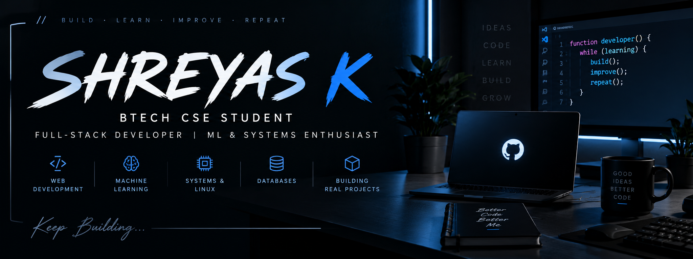

  

<h2 align="center">Building software. Learning systems. Solving problems.</h2>

  BTech CSE Student • Full-Stack Developer • ML & Systems

  <a href="https://github.com/Shreyaskura">GitHub</a>
  •
  <a href="https://github.com/Shreyaskura?tab=repositories">Projects</a>

---

## About Me

I'm a Computer Science Engineering student interested in building practical applications and understanding how software works under the hood.

- Full-stack web development
- Machine Learning
- Data Structures & Algorithms
- Linux & Operating Systems
- Database Systems
- Building and deploying real projects

---

## Tech Stack

  

---

## Featured Projects

<table>
<tr>
<td width="50%">

### 🖥️ <a href="https://github.com/Shreyaskura/SysCore_OSSP">SysCore OSSP</a>

Linux / Operating Systems project exploring processes, system calls, memory management and Linux internals.

**C • Linux • GCC • WSL**

</td>

<td width="50%">

### 🏥 <a href="https://github.com/Shreyaskura/medical-image-optimization">Medical Image Optimization</a>

Java project using Matrix Chain Multiplication to optimize the ordering of medical image processing operations.

**Java • DSA • Dynamic Programming**

</td>
</tr>

<tr>
<td width="50%">

### 🩺 Diabetes Risk Prediction

Machine Learning project using Logistic Regression, Random Forest and Cross-Validation.

**Python • Machine Learning • Scikit-learn**

</td>

<td width="50%">

### 📚 Library Management System

Full-stack library management application with a React frontend and Spring Boot backend.

**React • Spring Boot • MySQL**

</td>
</tr>

<tr>
<td width="50%">

### 🤟 <a href="https://github.com/Shreyaskura/SIGN-LANGUAGE-TRANSLATOR">Sign Language Translator</a>

Computer-vision based application designed to recognize sign language through camera input.

**Python • FastAPI • Computer Vision**

</td>

<td width="50%">

### 🚨 <a href="https://github.com/Shreyaskura/incidentIQ">incidentIQ</a>

Application focused on managing and tracking incidents through a modern web interface.

**Python • Web Development**

</td>
</tr>
</table>

### 🖥️ SysCore OSSP

Linux / Operating Systems project exploring processes, system calls, memory management and Linux internals.

**C • Linux • GCC • WSL**

</td>

<td width="50%">

### 🏥 Medical Image Optimization

Java project using Matrix Chain Multiplication to optimize the ordering of medical image processing operations.

**Java • DSA • Dynamic Programming**

</td>
</tr>

<tr>
<td width="50%">

### 🩺 Diabetes Risk Prediction

Machine Learning project using Logistic Regression, Random Forest and Cross-Validation.

**Python • Machine Learning • Scikit-learn**

</td>

<td width="50%">

### 📚 Library Management System

Full-stack library management application with a React frontend and Spring Boot backend.

**React • Spring Boot • MySQL**

</td>
</tr>

<tr>
<td width="50%">

### 🤟 Sign Language Translator

Computer-vision based application designed to recognize sign language through camera input.

**Python • FastAPI • Computer Vision**

</td>

<td width="50%">

### 🚨 incidentIQ

Application focused on managing and tracking incidents through a modern web interface.

**Python • Web Development**

</td>
</tr>
</table>

---

## GitHub Activity

  

  <i>Consistent commits. Continuous learning. Building in public.</i>

## Currently Learning

  

  <b>DSA • Machine Learning • Full-Stack Development • Linux • Databases</b>

---

## GitHub

  

  <i>Build • Learn • Improve • Repeat</i>

